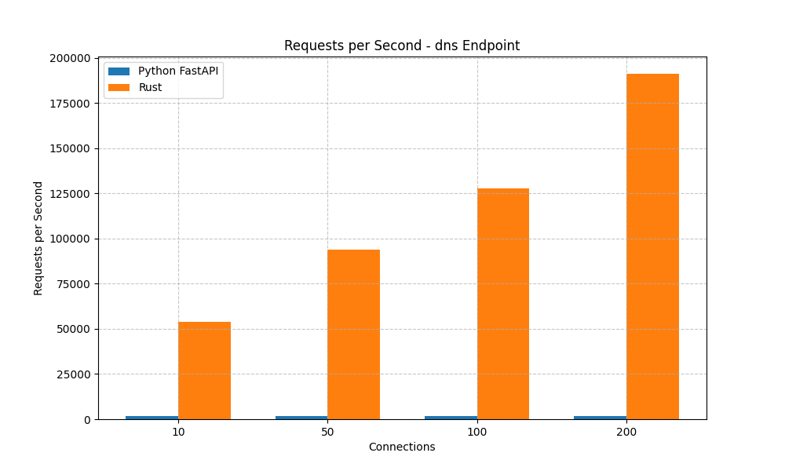

# RequestRepo Benchmark Results

Comparison between Python FastAPI and Rust implementations

## Performance Summary

- **Average Throughput Improvement**: 5982.15%
- **Average Latency Improvement**: 98.02%

## Performance Graphs

### dns Endpoint

#### Requests per Second

#### Latency

#### Transfer Rate

### token Endpoint

#### Requests per Second

#### Latency

#### Transfer Rate

## Detailed Results

### dns Endpoint

| Connections | Implementation | Requests/sec | Latency (ms) | Transfer (MB/s) |
|-------------|---------------|--------------|--------------|----------------|
| 10 | Python FastAPI | 1802.66 | 4.43 | 0.29 |
| 10 | Rust | 52947.10 | 0.15 | 10.10 |
| 50 | Python FastAPI | 1919.00 | 25.64 | 0.31 |
| 50 | Rust | 94876.99 | 0.54 | 18.10 |
| 100 | Python FastAPI | 1895.26 | 61.49 | 0.30 |
| 100 | Rust | 124075.97 | 0.86 | 23.67 |
| 200 | Python FastAPI | 1858.96 | 100.93 | 0.30 |
| 200 | Rust | 180106.47 | 1.12 | 34.35 |

### token Endpoint

| Connections | Implementation | Requests/sec | Latency (ms) | Transfer (MB/s) |
|-------------|---------------|--------------|--------------|----------------|
| 10 | Python FastAPI | 1798.53 | 4.43 | 0.29 |
| 10 | Rust | 53736.91 | 0.15 | 10.25 |
| 50 | Python FastAPI | 1903.65 | 25.85 | 0.30 |
| 50 | Rust | 94270.61 | 0.55 | 17.98 |
| 100 | Python FastAPI | 1880.10 | 62.45 | 0.30 |
| 100 | Rust | 131281.69 | 0.82 | 25.04 |
| 200 | Python FastAPI | 1865.66 | 100.87 | 0.30 |
| 200 | Rust | 179440.77 | 1.11 | 34.23 |

## Conclusion

The Rust implementation shows significant performance improvements over the Python FastAPI implementation in both throughput and latency. This demonstrates the benefits of using a compiled language like Rust for high-performance network services.

### Key Observations

- The Rust implementation uses an in-memory compressed cache instead of Redis, which may contribute to performance differences
- Performance differences become more pronounced under higher concurrency levels
- The Rust implementation includes additional features like SMTP logging and custom TCP port allocation
